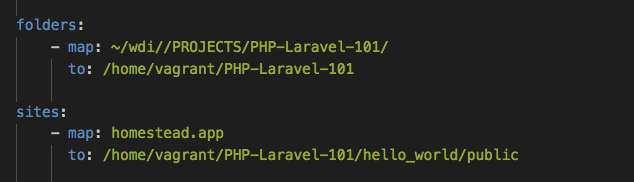

# PHP-Laravel-101

[PHP Docs](http://php.net/manual/en/)

[Laravel Docs](https://laravel.com/docs/5.5)

## Introduction to PHP and Laravel.

PHP, very much like node.js or ruby is a back-end language. It is especially suited for web development.

Laravel is a front-end framework for PHP. 

Writing PHP and Laravel feels very similar to writing Ruby and Rails respectively. 


An example of this can be seen here when we make controllers for websites:


### Rails
```
class ForumsController < ApplicationController

  def index
    @forums = Forum.all
  end

end
```

### Laravel
```
<?php

class FarmController extends Controller{
  public function index(){
    $farms = Farm::all();
    return view('farms.index', ['farms' => $farms]);
  }
}

?>
```


## Round One - Set up local server (welcome to hell)

- First we needs to install some dependancies.
For the sake of this lecture we ask our users to download:

  [Virtual Box](https://www.virtualbox.org/wiki/Downloads)

  and

  [Vagrant](https://www.vagrantup.com/downloads.html)

  specifically. There are other ways of running and coding PHP and Laravel but they will change some of the ways we write our code. These other means can be explored in the official docs linked in earlier in the lecture.


- Once these two are installed type the following in your terminal:

```
  vagrant box add laravel/homestead
  ```

- You will need to make a choice of what provider you want, enter 2 for virtualbox:


- Next type into your terminal:

```
git clone https://github.com/laravel/homestead.git Homestead
```

- To Initialize our homestead we need to cd into the homestead directory and type:

```
bash init.sh
```

- Open the homestead directory in your preferred text editor, in homestead.yaml change the following::

 

to example:



- In the terminal type:
```
    sudo nano /etc/hosts
```

  - Enter account password and a new screen will apper that will allow you to update your file. 
  - At the end of the file add the following:
```    
192.168.10.10 homestead.app
```
  - Press ctrl + X followed by Y and then enter to save your changes. 

## Round Two - Installing Composer

- Go to: [https://getcomposer.org/download/](https://getcomposer.org/download/)

- Copy & paste the provided code (we'll allow it... this time) into the terminal. 

- Next type into terminal: 
```
mv composer.phar /usr/local/bin/composer
```

## Round Three - We're going to make our first app!

- Next we'll want to put into our terminal:
```
echo 'PATH="$HOME/.composer/vendor/bin:$PATH"' >> ~/.bash_profile
```
```
 source ~/.bash_profile
```

- Now in a seperate project directory you can create a Laravel app by typing in:
```
laravel new project_name
```

  (To follow along we typed in - "laravel new hello_world". Ignore any errors you may see!)

- Cd back into the homestead directory and in your terminal type:
  ```
  vagrant up
  ```

- Now type:
``` 
vagrant ssh
```

- cd into PHP-Laravel-101/hello_world/  and carefully type the following one by one:
```
rm composer.lock
```
```
composer install
```
```
mv .env.example .env
```
```
php artisan key:generate
```
- Type exit to leave and in your browser type in homestead.app to see:


From here the world is your oyster! We recommend following the [Laravel Quickstart Quide](https://laravel.com/docs/4.2/quick#routing) starting at routing to begin making your app. We also recommend the series of [videos](https://www.youtube.com/channel/UCSJbGtTlrDami-tDGPUV9-w/search?query=laravel) by YouTuber Academind.
